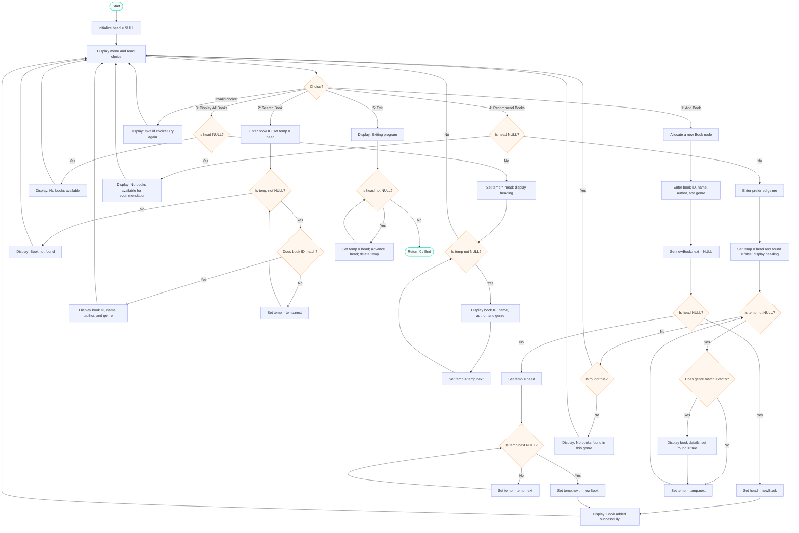

```mermaid
flowchart TD
    Start(["Start"]) --> Init["Initialize head = NULL"]
    Init --> Menu["Display menu and read choice"]
    Menu --> Choice{"Choice?"}

    Choice -->|1: Add Book| Allocate["Allocate a new Book node"]
    Allocate --> Input["Enter book ID, name, author, and genre"]
    Input --> SetNext["Set newBook.next = NULL"]
    SetNext --> EmptyAdd{"Is head NULL?"}
    EmptyAdd -->|Yes| SetHead["Set head = newBook"]
    EmptyAdd -->|No| AddTemp["Set temp = head"]
    AddTemp --> Last{"Is temp.next NULL?"}
    Last -->|No| AdvanceAdd["Set temp = temp.next"]
    AdvanceAdd --> Last
    Last -->|Yes| Append["Set temp.next = newBook"]
    SetHead --> Added["Display: Book added successfully"]
    Append --> Added
    Added --> Menu

    Choice -->|2: Search Book| SearchInput["Enter book ID; set temp = head"]
    SearchInput --> SearchMore{"Is temp not NULL?"}
    SearchMore -->|No| NotFound["Display: Book not found"]
    SearchMore -->|Yes| MatchID{"Does book ID match?"}
    MatchID -->|Yes| SearchResult["Display book ID, name, author, and genre"]
    MatchID -->|No| AdvanceSearch["Set temp = temp.next"]
    AdvanceSearch --> SearchMore
    SearchResult --> Menu
    NotFound --> Menu

    Choice -->|3: Display All Books| EmptyDisplay{"Is head NULL?"}
    EmptyDisplay -->|Yes| NoBooks["Display: No books available"]
    NoBooks --> Menu
    EmptyDisplay -->|No| DisplayInit["Set temp = head; display heading"]
    DisplayInit --> DisplayMore{"Is temp not NULL?"}
    DisplayMore -->|Yes| ShowBook["Display book ID, name, author, and genre"]
    ShowBook --> AdvanceDisplay["Set temp = temp.next"]
    AdvanceDisplay --> DisplayMore
    DisplayMore -->|No| Menu

    Choice -->|4: Recommend Books| EmptyRecommend{"Is head NULL?"}
    EmptyRecommend -->|Yes| NoRecommendations["Display: No books available for recommendation"]
    NoRecommendations --> Menu
    EmptyRecommend -->|No| GenreInput["Enter preferred genre"]
    GenreInput --> RecommendInit["Set temp = head and found = false; display heading"]
    RecommendInit --> RecommendMore{"Is temp not NULL?"}
    RecommendMore -->|Yes| GenreMatch{"Does genre match exactly?"}
    GenreMatch -->|Yes| ShowRecommendation["Display book details; set found = true"]
    GenreMatch -->|No| AdvanceRecommend["Set temp = temp.next"]
    ShowRecommendation --> AdvanceRecommend
    AdvanceRecommend --> RecommendMore
    RecommendMore -->|No| AnyFound{"Is found true?"}
    AnyFound -->|Yes| Menu
    AnyFound -->|No| NoGenre["Display: No books found in this genre"]
    NoGenre --> Menu

    Choice -->|5: Exit| ExitMessage["Display: Exiting program"]
    ExitMessage --> Cleanup{"Is head not NULL?"}
    Cleanup -->|Yes| FreeNode["Set temp = head; advance head; delete temp"]
    FreeNode --> Cleanup
    Cleanup -->|No| Finish(["Return 0 / End"])

    Choice -->|Invalid choice| Invalid["Display: Invalid choice! Try again"]
    Invalid --> Menu

    classDef process fill:#eef2ff,stroke:#818cf8
    classDef decision fill:#fff7ed,stroke:#fb923c
    classDef terminal fill:#f0fdfa,stroke:#2dd4bf
    class Init,Menu,Allocate,Input,SetNext,SetHead,AddTemp,AdvanceAdd,Append,Added,SearchInput,NotFound,SearchResult,AdvanceSearch,NoBooks,DisplayInit,ShowBook,AdvanceDisplay,NoRecommendations,GenreInput,RecommendInit,ShowRecommendation,AdvanceRecommend,NoGenre,ExitMessage,FreeNode,Invalid process
    class Choice,EmptyAdd,Last,SearchMore,MatchID,EmptyDisplay,DisplayMore,EmptyRecommend,RecommendMore,GenreMatch,AnyFound,Cleanup decision
    class Start,Finish terminal
```
