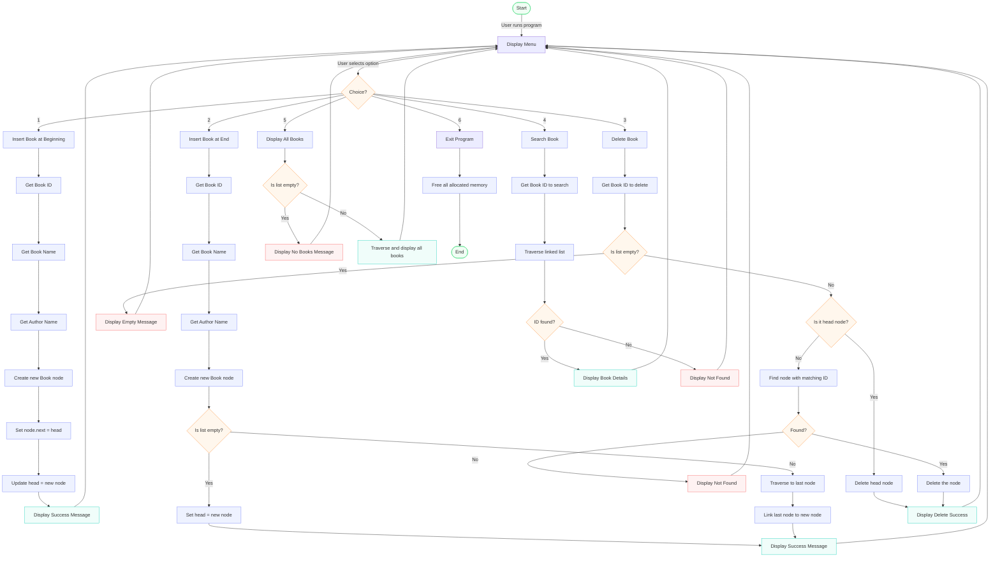

```mermaid
flowchart TD
    Start([Start]) -->|User runs program| Menu[Display Menu]
    Menu -->|User selects option| Choice{Choice?}

    Choice -->|1| InsertBeg[Insert Book at Beginning]
    InsertBeg --> GetID1[Get Book ID]
    GetID1 --> GetName1[Get Book Name]
    GetName1 --> GetAuthor1[Get Author Name]
    GetAuthor1 --> CreateNode1[Create new Book node]
    CreateNode1 --> SetNext1[Set node.next = head]
    SetNext1 --> UpdateHead1[Update head = new node]
    UpdateHead1 --> Success1[Display Success Message]
    Success1 --> Menu

    Choice -->|2| InsertEnd[Insert Book at End]
    InsertEnd --> GetID2[Get Book ID]
    GetID2 --> GetName2[Get Book Name]
    GetName2 --> GetAuthor2[Get Author Name]
    GetAuthor2 --> CreateNode2[Create new Book node]
    CreateNode2 --> CheckEmpty{Is list empty?}
    CheckEmpty -->|Yes| SetHead[Set head = new node]
    CheckEmpty -->|No| Traverse[Traverse to last node]
    Traverse --> LinkNode[Link last node to new node]
    SetHead --> Success2[Display Success Message]
    LinkNode --> Success2
    Success2 --> Menu

    Choice -->|3| Delete[Delete Book]
    Delete --> GetDeleteID[Get Book ID to delete]
    GetDeleteID --> CheckEmpty2{Is list empty?}
    CheckEmpty2 -->|Yes| EmptyMsg[Display Empty Message]
    CheckEmpty2 -->|No| CheckHead{Is it head node?}
    CheckHead -->|Yes| DeleteHead[Delete head node]
    CheckHead -->|No| FindNode[Find node with matching ID]
    FindNode --> FoundCheck{Found?}
    FoundCheck -->|No| NotFoundMsg[Display Not Found]
    FoundCheck -->|Yes| DeleteNode[Delete the node]
    DeleteHead --> DeleteSuccess[Display Delete Success]
    DeleteNode --> DeleteSuccess
    EmptyMsg --> Menu
    NotFoundMsg --> Menu
    DeleteSuccess --> Menu

    Choice -->|4| Search[Search Book]
    Search --> GetSearchID[Get Book ID to search]
    GetSearchID --> SearchTraverse[Traverse linked list]
    SearchTraverse --> SearchFound{ID found?}
    SearchFound -->|Yes| DisplayBook[Display Book Details]
    SearchFound -->|No| SearchNotFound[Display Not Found]
    DisplayBook --> Menu
    SearchNotFound --> Menu

    Choice -->|5| Display[Display All Books]
    Display --> CheckEmpty3{Is list empty?}
    CheckEmpty3 -->|Yes| NoBooks[Display No Books Message]
    CheckEmpty3 -->|No| DisplayAll[Traverse and display all books]
    NoBooks --> Menu
    DisplayAll --> Menu

    Choice -->|6| Exit[Exit Program]
    Exit --> Cleanup[Free all allocated memory]
    Cleanup --> End([End])

    classDef startEnd fill:#f0fdf4,stroke:#4ade80
    classDef process fill:#eef2ff,stroke:#818cf8
    classDef decision fill:#fff7ed,stroke:#fb923c
    classDef success fill:#f0fdfa,stroke:#2dd4bf
    classDef error fill:#fef2f2,stroke:#f87171

    class Start,End startEnd
    class InsertBeg,InsertEnd,Delete,Search,Display,GetID1,GetName1,GetAuthor1,CreateNode1,SetNext1,UpdateHead1,GetID2,GetName2,GetAuthor2,CreateNode2,Traverse,LinkNode,SetHead,GetDeleteID,FindNode,DeleteHead,DeleteNode,GetSearchID,SearchTraverse,DisplayAll,Cleanup process
    class Choice,CheckEmpty,CheckEmpty2,CheckHead,FoundCheck,SearchFound,CheckEmpty3 decision
    class Success1,Success2,DeleteSuccess,DisplayBook,DisplayAll success
    class EmptyMsg,NotFoundMsg,SearchNotFound,NoBooks error
```
