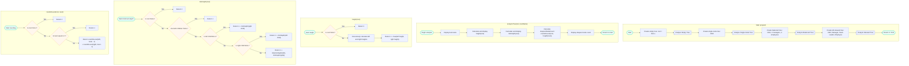

```mermaid
flowchart TD
    subgraph Main["Main program"]
        S(["Start"]) --> E["Create empty tree: root = NULL"]
        E --> AE[["Analyze Empty Tree"]]
        AE --> N["Create single-node tree: CEO"]
        N --> AN[["Analyze Single-Node Tree"]]
        AN --> B["Create balanced tree: CEO, 2 managers, 4 employees"]
        B --> AB[["Analyze Balanced Tree"]]
        AB --> K["Create left-skewed tree: CEO, Manager, Team Leader, Employee"]
        K --> AK[["Analyze Skewed Tree"]]
        AK --> F(["Return 0 / End"])
    end

    subgraph Analyze["analyzeTree(root, testName)"]
        A1(["Begin analysis"]) --> A2["Display test name"]
        A2 --> A3["Calculate and display height(root)"]
        A3 --> A4["Calculate and display minDepth(root)"]
        A4 --> A5["Calculate deepestNodeCount:<br/>countAtLevel(root, height(root))"]
        A5 --> A6["Display deepest node count"]
        A6 --> A7(["Return to main"])
    end

    subgraph Height["height(root)"]
        H1(["Start height"]) --> H2{"Is root NULL?"}
        H2 -->|Yes| H3["Return 0"]
        H2 -->|No| H4["Recursively calculate left and right heights"]
        H4 --> H5["Return 1 + max(left height, right height)"]
    end

    subgraph Minimum["minDepth(root)"]
        M1(["Start minimum depth"]) --> M2{"Is root NULL?"}
        M2 -->|Yes| M3["Return 0"]
        M2 -->|No| M4{"Are both children NULL?"}
        M4 -->|Yes| M5["Return 1"]
        M4 -->|No| M6{"Is left child NULL?"}
        M6 -->|Yes| M7["Return 1 + minDepth(right child)"]
        M6 -->|No| M8{"Is right child NULL?"}
        M8 -->|Yes| M9["Return 1 + minDepth(left child)"]
        M8 -->|No| M10["Return 1 + min(minDepth(left), minDepth(right))"]
    end

    subgraph Count["countAtLevel(root, level)"]
        C1(["Start counting"]) --> C2{"Is root NULL?"}
        C2 -->|Yes| C3["Return 0"]
        C2 -->|No| C4{"Is level equal to 1?"}
        C4 -->|Yes| C5["Return 1"]
        C4 -->|No| C6["Return countAtLevel(left, level - 1)<br/>+ countAtLevel(right, level - 1)"]
    end

    classDef process fill:#eef2ff,stroke:#818cf8
    classDef decision fill:#fff7ed,stroke:#fb923c
    classDef terminal fill:#f0fdfa,stroke:#2dd4bf
    class E,AE,N,AN,B,AB,K,AK,A2,A3,A4,A5,A6,H3,H4,H5,M3,M5,M7,M9,M10,C3,C5,C6 process
    class H2,M2,M4,M6,M8,C2,C4 decision
    class S,F,A1,A7,H1,M1,C1 terminal
```
