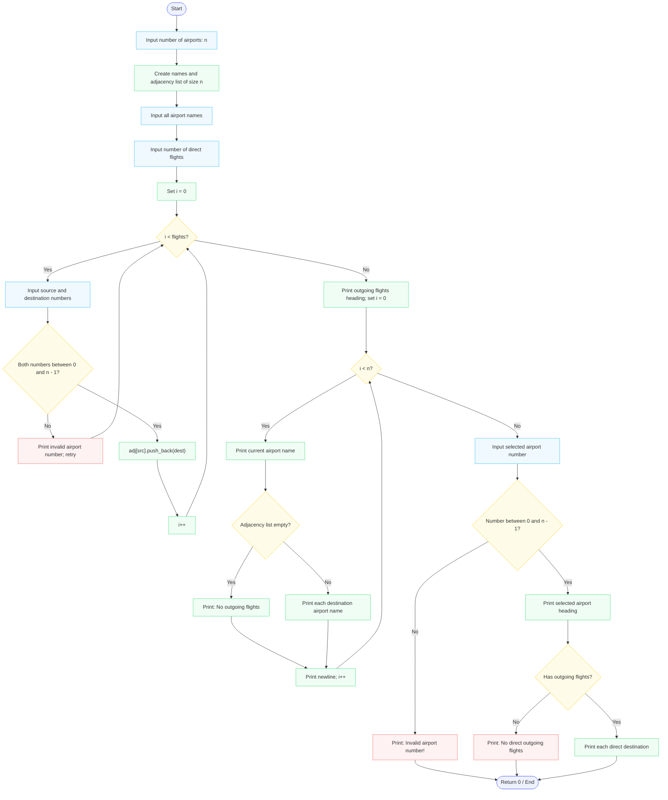

```mermaid
graph TD
    Start([Start]) --> Input1["Input number of airports: n"]
    Input1 --> Init1["Create names and adjacency list of size n"]
    Init1 --> Input2["Input all airport names"]
    Input2 --> Input3["Input number of direct flights"]
    Input3 --> InitFlights["Set i = 0"]
    InitFlights --> FlightLoop{"i < flights?"}
    FlightLoop -->|Yes| Input4["Input source and destination numbers"]
    Input4 --> Validate{"Both numbers between 0 and n - 1?"}
    Validate -->|No| Error1["Print invalid airport number; retry"]
    Error1 --> FlightLoop
    Validate -->|Yes| AddEdge["adj[src].push_back(dest)"]
    AddEdge --> NextFlight["i++"]
    NextFlight --> FlightLoop

    FlightLoop -->|No| Display["Print outgoing flights heading; set i = 0"]
    Display --> Loop1{"i < n?"}
    Loop1 -->|Yes| PrintAirport["Print current airport name"]
    PrintAirport --> AirportEmpty{"Adjacency list empty?"}
    AirportEmpty -->|Yes| ShowEmpty["Print: No outgoing flights"]
    AirportEmpty -->|No| ShowFlights1["Print each destination airport name"]
    ShowEmpty --> NextAirport["Print newline; i++"]
    ShowFlights1 --> NextAirport
    NextAirport --> Loop1

    Loop1 -->|No| Input5["Input selected airport number"]
    Input5 --> ValidateSelect{"Number between 0 and n - 1?"}
    ValidateSelect -->|No| Error2["Print: Invalid airport number!"]
    ValidateSelect -->|Yes| SelectedHeading["Print selected airport heading"]
    SelectedHeading --> CheckFlights{"Has outgoing flights?"}
    CheckFlights -->|No| NoFlights["Print: No direct outgoing flights"]
    CheckFlights -->|Yes| ShowSelected["Print each direct destination"]
    Error2 --> End(["Return 0 / End"])
    NoFlights --> End
    ShowSelected --> End

    classDef inputNode stroke:#38bdf8,fill:#f0f9ff
    classDef processNode stroke:#4ade80,fill:#f0fdf4
    classDef decisionNode stroke:#facc15,fill:#fefce8
    classDef outputNode stroke:#a78bfa,fill:#f5f3ff
    classDef errorNode stroke:#f87171,fill:#fef2f2
    classDef startEnd stroke:#818cf8,fill:#eef2ff

    class Input1,Input2,Input3,Input4,Input5 inputNode
    class Init1,InitFlights,AddEdge,NextFlight,Display,PrintAirport,ShowEmpty,ShowFlights1,NextAirport,SelectedHeading,ShowSelected processNode
    class FlightLoop,Validate,Loop1,AirportEmpty,ValidateSelect,CheckFlights decisionNode
    class Error1,Error2,NoFlights errorNode
    class Start,End startEnd
```
